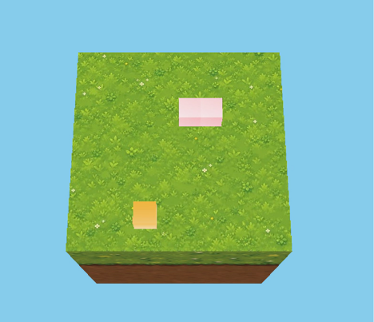

# SnakeGame
# OpenGL 贪吃蛇项目

> 项目简介：基于 C++ + OpenGL（GLFW/GLAD）实现的3D贪吃蛇，本次文档记录项目开发过程中的设计思考、踩坑记录、已实现解决方案与后续迭代方向。

## 一、核心底层矛盾：C++ OOP 与 OpenGL 范式冲突

OpenGL 是面向过程、面向数据的图形API；C++ 是面向对象语言。二者底层思想天然不兼容。 初期方案：强行使用纯面向对象封装，拆分大量类：`Window`、`Shader`、`Camera`。

- 优点：可以直接实例化对象，快速创建Shader、Camera实例，调用简单。
- 缺点：GPU资源（VBO/VAO/EBO）和C++对象发生强耦合，资源归属混乱，后期难以解耦。
    
    > 反思：渲染相关资源不适合无脑OOP封装，渲染逻辑本身更适合放在主流程中。
    

## 二、踩坑记录 & 解决方案

### 1. float 浮点数精度陷阱

**问题**：浮点数在计算机中是二进制近似存储，数学上相等的两个浮点数，使用 `==` 强相等判断会失败。 在贪吃蛇坐标判断（吃到食物、碰撞检测）中直接导致逻辑异常。 **解决方案**

1. 方案A（本次项目采用）：地图网格坐标改用整型`int`，从根源规避浮点误差。
2. 方案B：浮点坐标采用**容差判定**，判断两个浮点数差值小于极小阈值，代替直接`==`比较。

### 2. GPU资源所有权与生命周期管理

**问题**：前期对象封装过度，VAO/VBO等GPU资源归属不清晰，无法正确执行`glDelete*`释放资源，资源生命周期难以管控。 **两种资源释放方案**

1. 在类的析构函数中编写GPU资源释放代码，对象销毁自动释放资源。
2. 手动自定义资源释放函数，在合适时机主动调用释放。
    
    > 核心要点：必须理清CPU侧C++对象和GPU显存资源的生命周期绑定关系。
    

### 3. 编译期与运行期相对路径混淆

**问题**：两种路径查找逻辑完全独立，极易混淆：

1. **编译期（`#include`头文件）**
    - 同目录下`.h`头文件，可以直接写文件名引入；
    - 编译器会在当前源文件目录 + 项目配置的附加头文件目录中搜索头文件。
    - 区分：第三方库头文件（GLFW/GLAD）、自己写的自定义头文件。
2. **运行期（加载纹理PNG等资源）**
    - 纹理、图片资源读取，基准是**程序工作目录**，不是cpp源码所在目录。
        
        > 坑点：编译能通过，运行时找不到图片纹理，大多是运行工作目录配置错误。
        

### 4. 渲染层与游戏逻辑层强耦合

**问题**：游戏逻辑更新完成后，直接在同一个函数内读取数据并渲染。游戏逻辑代码和渲染代码写在一起，高度耦合。

- 弊端：代码混乱，难以扩展，资源管控难度上升；数据所有权模糊，不清楚数据在哪创建、何时销毁。
    
    > 后续项目优化思路（本项目未落地）： 逻辑层完全不感知OpenGL的存在；**渲染层主动读取逻辑层暴露的数据**，逻辑层只负责维护游戏数据，单向数据读取，解除强耦合。也就是数据驱动渲染。
    

### 5. 游戏帧率与移动速度绑定

**问题**：直接按帧更新贪吃蛇移动，帧率波动会导致蛇移动速度忽快忽慢。 **解决方案**：使用**时间步长（deltaTime）**，基于真实流逝时间驱动游戏逻辑，而不是帧率。保证无论帧率高低，游戏移动速度恒定。

### 6. 函数/类相互依赖，循环引用问题

**场景**：`CreateWindow`创建窗口时需要注册回调函数；回调函数又需要访问当前Window实例，形成互相依赖。 **解决方案**：使用 `glfwSetWindowUserPointer`，把当前`this`指针挂载到GLFW窗口对象上。 流程：

1. 创建窗口，提前把类实例指针存入窗口user pointer；
2. 注册回调函数；
3. 在回调内部，通过`glfwGetWindowUserPointer`取回对象指针，访问类成员。 解决两个函数/类互相依赖、前向声明难以处理的循环调用问题。

## 三、整体项目反思 & 后续迭代方向

1. 不要无脑对OpenGL渲染资源做面向对象封装，分清适合OOP的业务对象和面向数据的GPU资源。
2. 解耦核心目标：**逻辑层与渲染层分离**，逻辑层只维护游戏数据，不引入任何图形API。渲染层单向读取逻辑层数据，实现数据驱动渲染。
3. 资源生命周期优先设计，在编码前期就确定资源是谁创建、谁持有、谁销毁。
4. 坐标系统：网格类游戏优先考虑整型坐标，减少浮点判等带来的精度bug。
5. 时间驱动游戏逻辑，永远不要用帧率控制物体移动。

## 四、遗留待优化点（本项目未重构）

- 当前代码渲染层和游戏逻辑层耦合严重；下一个项目练习分层架构，实现逻辑与渲染隔离。
- 数据所有权、全局数据管控还不够成熟，需要在新项目中强化资源生命周期设计。

---

## 五、项目总览

- **项目名称**：OpenGL 贪吃蛇（3D）
- **技术栈**：C++、OpenGL 4.6（GLFW / GLAD / GLM）、Shader、纹理贴图（stb_image）
- **运行环境**：Windows + Visual Studio（x64 Debug）
- **完成状态**：核心玩法可运行——蛇在 1×1 网格地图内移动、吃食物增长、边界阻挡、时间步长控制速度
- **代码结构（当前）**
  - `main.cpp`：窗口 / 相机 / Shader / 物体装配、主循环、蛇身绘制
  - `core/world`：`mywindow`（窗口）、`Shader`、`camera`
  - `data/data`：立方体与地板顶点数据
  - `renderer/object` + `bridge`：物体与 VAO/VBO/纹理封装
  - `renderer/renderer`：`draw_object`、输入、位置矩阵、游戏逻辑（`snake_game_logic`）、食物生成

### 玩法参数

| 项 | 值 |
|----|----|
| 地图 | 1×1 网格，范围 [-0.45, 0.45]，步长 0.1（10×10 格点） |
| 蛇 | 初始 2 段，吃食物增长 |
| 食物 | 地图内随机生成，避开蛇身 |
| 移动 | 固定时间步长，`stepInterval = 1.0s` → 每秒一格 |
| 吃食物判定 | `glm::distance(head, food) < 0.001`（容差，规避浮点误差） |
| 边界 | 越界则不移动，原地阻挡 |

## 六、设计方案

### 1. 整体架构（当前实现）

项目分三层，但未完全落地：`main` 负责装配与主循环；渲染层 `renderer` 提供绘制、输入、位置矩阵；游戏逻辑当前位于 `renderer.cpp` 的 `snake_game_logic`（自由函数，10 参数，仍持有 Shader/object/GLFWwindow）。

### 2. 数据驱动设计（目标方案，未落地）

- 逻辑层只维护游戏数据，完全不感知 OpenGL；
- 渲染层主动读取逻辑层暴露的数据（单向读取），实现**数据驱动渲染**。

### 3. 移动与时间驱动

- 方向由键盘设定（`direction`），每帧读取；
- 用 `deltaTime` 累加 `timeSum`，达到 `stepInterval` 才走一步（固定时间步长），速度与帧率解耦。

### 4. 吃食物与增长

- 蛇头与食物距离 < 0.001 判定吃到；
- 吃到：不去尾（增长）并刷新食物；未吃到：去尾前移。

### 5. 边界

- 越界则不移动，原地挡住。

## 七、问题（结合当前代码实况）

1. **全局状态泛滥**：`direction / snakePositions / foodPos / timeSum` 均为全局变量，状态归属不清。
2. **逻辑层耦合渲染**：`snake_game_logic` 位于 `renderer.cpp`，签名仍含 `Shader`、`object`、`GLFWwindow`，并直接调用 `glfwGetKey` —— 逻辑未与渲染解耦。
3. **10 参数"上帝函数"**：`snake_game_logic` 参数过长，是代码坏味道，与全局变量问题同源（状态未收拢成单位）。
4. **缺少游戏结束判定**：撞墙仅阻挡不结束；无撞自身判定；蛇塞满地图时 `random_food_position` 可能死循环。
5. **浮点精度**：已用容差判定规避（`glm::distance < 0.001`），但更根本的解法是整型网格坐标（见踩坑记录一）。

## 八、后续迭代方向

1. **重构收拢状态**：把游戏状态 + 更新逻辑收成 `SnakeGame` 类，成员变量即现有全局，方法为 `handleInput` / `update` / 只读 getter，删除函数中的 `Shader` / `object` / `GLFWwindow` 参数。
2. **解耦落地**：逻辑层零 OpenGL，渲染层单向读逻辑层数据（数据驱动渲染）。
3. **输入解耦**：逻辑不自己 `glfwGetKey`，由外部喂入输入状态。
4. **补全玩法闭环**：撞墙结束、撞自身结束、食物刷满处理。
5. **整型网格坐标**：坐标改用 `int` 索引，从根源消除浮点误差。

---

## 九、运行与操作指南

- **构建环境**：Windows + Visual Studio，打开 `SnakeGame.slnx`，x64 Debug 编译运行。
- **依赖**：GLFW、GLAD（OpenGL 4.6）、GLM、stb_image（纹理加载）。
- **按键**：`W / S / A / D` 设定蛇移动方向（按一次后持续朝该方向自动移动）；`ESC` 退出窗口。
- **运行注意（关键坑）**：纹理（PNG/JPG）加载基于**程序工作目录**，需将工作目录设置为项目根目录（`res/` 所在目录），否则编译正常但运行时找不到纹理。
- **启动后**：先按一个方向键让蛇动起来，蛇按固定步长每秒一格移动（`stepInterval = 1.0s`），吃到食物增长一格并刷新食物。

## 十、关键机制原理（深化）

### 1. 浮点判等失效的根因：路径分叉

数学上相同的浮点值，若由**不同算术路径**产生，其舍入尾数可能不同，最后一位二进制不等，导致 `==` 判 False。

- 蛇头坐标：`-0.35f + 0.1f + 0.1f + 0.1f`（累加）；
- 食物坐标：`-0.45f + i * 0.1f`（公式）。

两者数学相等，二进制不等（约 1e-9）。故吃食物判定必须用**容差**：`glm::distance(head, food) < 0.001`。更根治的方案是**整型网格索引**，从源头消除误差。

### 2. 固定步长累加器：减法而非清零

- `timeSum += deltaTime`，达到 `stepInterval` 才走一步；
- 扣减 `timeSum -= stepInterval` 而非清零——清零会丢弃每次多攒的尾数，长期平均每步**偏慢**；扣减保留尾数，平均严格等于步长；
- 效果：移动速度与帧率解耦，无论帧率高低都恒速。

## 十一、关键决策与走过的弯路

1. **移动输入模型**：最初用 `moveState`（按住才动、一次一格）→ 改为 `direction`（按一次设定方向、之后自动走），期间反复横跳，最终确认"输入只设方向、逻辑定时走"。
2. **吃食物判定**：最初 `newHead == foodPos`（浮点失效）→ 试过"相邻再跳"（蛇身脱节）→ 最终定为容差 `glm::distance < 0.001`。
3. **备选方案权衡**：尝试过 `(int)` 强转（丢信息/撞格）、放大坐标 100 倍（需全局缩放牵动几何与相机），均被否决，选择改动最小的容差。
4. **边界处理**：撞墙选择"不移动、原地阻挡"，未做结束判定，留作后续迭代。

## 十二、功能验收清单

**已实现**

- [x] 蛇在 1×1 网格内移动（WASD 设方向）
- [x] 固定时间步长移动（1 格/秒，与帧率解耦）
- [x] 吃食物增长 + 食物随机刷新（容差判定，避开蛇身）
- [x] 边界阻挡（越界不移动）
- [x] 纹理渲染（地板 / 蛇 / 食物）

**未实现（后续迭代）**

- [ ] 撞墙 / 撞自身游戏结束判定
- [ ] 菜单 / 暂停
- [ ] 食物刷满地图时的处理
- [ ] 逻辑层与渲染层真正解耦（当前逻辑仍在 `renderer.cpp`）

## 十三、开源

- **依赖清单**：GLFW、GLAD、GLM、stb_image。
- **运行效果**：演示图片见[十六章 · 运行效果](#十六运行效果)。
- **说明**：本 md 记录开发过程与决策，作为开源日志留存。

## 十四、代码质量改进点

- `snakePositions.insert(begin(), ...)` 为 O(n) 操作：蛇较短时无感，长度增长后值得考虑固定大小数组或双端结构。
- 随机源 `rand()` 可换为 `<random>` 的 `mt19937`，分布更均匀。
- 全局变量与 10 参数函数待收拢为类（见第七、八章）。
- 硬编码常量（0.1 步长、0.001 容差、mapMin/mapMax）建议集中为常量定义。

## 十五、学习收获小结

- 第一个完整跑通的图形学小游戏：掌握窗口、相机、Shader、纹理、VAO 全流程。
- 关键认知：浮点不能 `==` 强相等（根因是"路径分叉"）；用时间驱动逻辑而非帧率；逻辑层与渲染层要分层。
- 工程认知：能跑 ≠ 能维护。代码工程化评分 4/10，但认知在涨——下一步目标是把"跑通"变成"干净"。

---

## 十六、运行效果

2026/10/05
   

---
